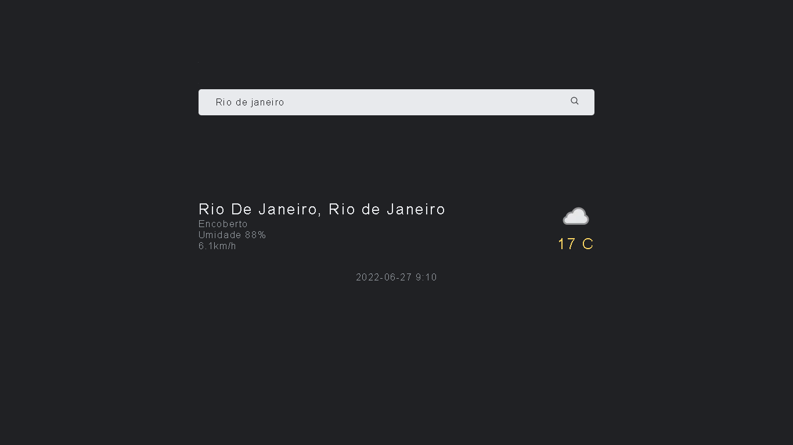

# `Weather App`
Weather é um WebApp que tem funcionalidade de ver o clima em uma determinada cidade.

`Weather App` foi desenvolvido com intuito de práticar react Js e treinar também o Vanilla Js.

<a href=''>`Visualize aqui`<a>

## Tecnologias utilizadas

- `Scss`
- `ReactJs`
- `Api Weather`